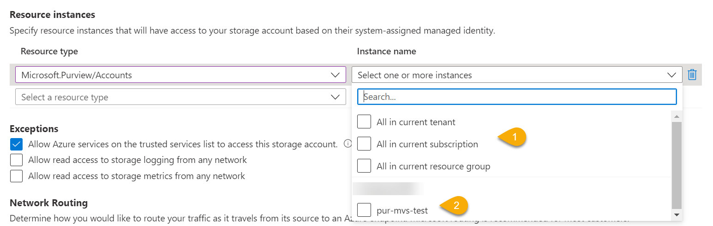

Welcome to the Azure shorts for August 2022. Below are the azure updates that I personally find the most interesting. All updates are `General Availability` updates so can be used by everybody with a Azure subsription.

# The updates

## Resource instance rules for access to Azure Storage

### What changed

A new layer of security has been added to Azure storage accounts that secure and control access to your account, **Resource instance rules**. With this new layer you can configure your storage account to only allow access from specific resource instances of a Azure services.

For example, you can specify access to your storage account from a Purview account.

This can be done on different levels

1. On a grouped scope (Tenant, Subscription or resource group)
2. On a specific instance by name

Below image shows this new setting in detail.

### Resources

[Grant access from Azure resource instances](https://docs.microsoft.com/en-us/azure/storage/common/storage-network-security?tabs=azure-portal#grant-access-from-azure-resource-instances)

## Network security groups support for private endpoints

### What changed

When you configure a private endpoint for you Azure service in a subnet, it does not use the network policies like `Network Security Groups` and `User Defined Routes`. This updates changes that behavious by enabling these policies for private endpoints setting the `PrivateEndpointNetworkPolicies` property and enabling it on your subnet. 

### Resources

[General availability: Network security groups support for private endpoints](https://azure.microsoft.com/en-us/updates/general-availability-of-network-security-groups-support-for-private-endpoints/)

[Manage network policies for private endpoints](https://docs.microsoft.com/en-us/azure/private-link/disable-private-endpoint-network-policy?tabs=network-policy-portal)

The following video shown the usage of this new feature and how Private Endpoints previously worked without this feature.
So the demo does not go a smooth as it should but it does show the use case of the feature and what you can achieve with it.

[Preview of Private Link NSG and UDR Support](https://www.youtube.com/watch?v=pZdlue6jwiI)