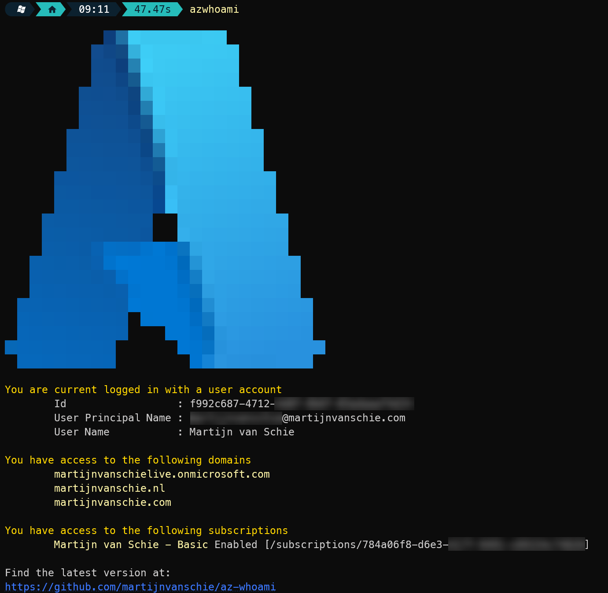

# Who Am I, an Azure CLI wrapper story

## Why development is still fun for me

As a solution architect you distance yourself more and more from the hands-on engineering work, especially during your daily work. And although i started out as a fulltime dotnet developer, for me this was not an issue as i noticed i could not perform this work for more than a few days in the end. But this does not mean i left behind my initial passion for development and technology, i just moved this to my spare time :)

But developing apps in my spare time is not just for the hobby. It's also a way to keep up with the latest technologies. This not only helps me innovate more but also allows me to understand the engineers i work with even better.

## But wait, what kind of apps do you develop?

Development for me should be fun and it does not really matter which technology i use at that time. I've developed `.NET` apps (Core or Framework), experimented with `Node.js` and `Deno`, developed `Angular` SPA's that integrates with `Azure AD / MSAL`... i even tried out an `Azure Data Factory` pipeline and created `Databricks` workflows. All for the greater good :).

But it should also, and in some way, add value to me or the customer i'm working for. So when i development some app, or website, it usually involved testing a new technology or Framework or trying to automate some process i do often (which makes it a useful business case for me).

This resulted in one of my latest project, [AzWhoAmI](https://github.com/martijnvanschie/az-whoami) because it fulfills the following requirements:

- Automate something i do often, or make it easier to execute
- Try out GitHub workflows and automate releases (Awesome)
- Try out the `CliWrap` library for command line interaction (Replaced the `Process` class)
- Create a fancy image with `Spectre.Console` :)
- Bonus: Make use of my own Node.js action in my workflow
- Extra Bonus: Create a banner use the new Microsoft Designer tool

> Will the list ever stop :)

## So what's the story behind this specific CLI app?

I've been around for a while and was really used to user interfaces and desktop apps for a long time. Even within Visual Studio code for instance i have a hard time adding a reference to a project (When did the `Add Reference` context menu go).

But working with command-line apps for the last couple of years made me appreciate them and the automation they enable. Hence making this wrapper cli tool around some az commands i often use.

I found that, when working with Azure CLI in combination with multiple tenants, accounts and subscriptions, it's sometime unclear which account is currently logged in on the CLI. So i tried to create my own CLI for this. It basically runs some calls against the Azure CLI like listing tenant info, the service principal and signed-in-user, and prints them to the screen in a nice, readable, format.

Below is an example of the output using my own Azure tenant.

## GitHub project

Feel free to download and test the CLI. It's available on GutHub.

[AzWhoAmI](https://github.com/martijnvanschie/az-whoami)

## References

My very own [Create Dotnet Version](https://github.com/martijnvanschie/create-dotnet-versions-action) GitHub action  
A command-line wrapper library called [CliWrap](https://github.com/Tyrrrz/CliWrap)  
This awesome [Spectre.Console](https://github.com/spectreconsole/spectre.console) library to create fancy console apps