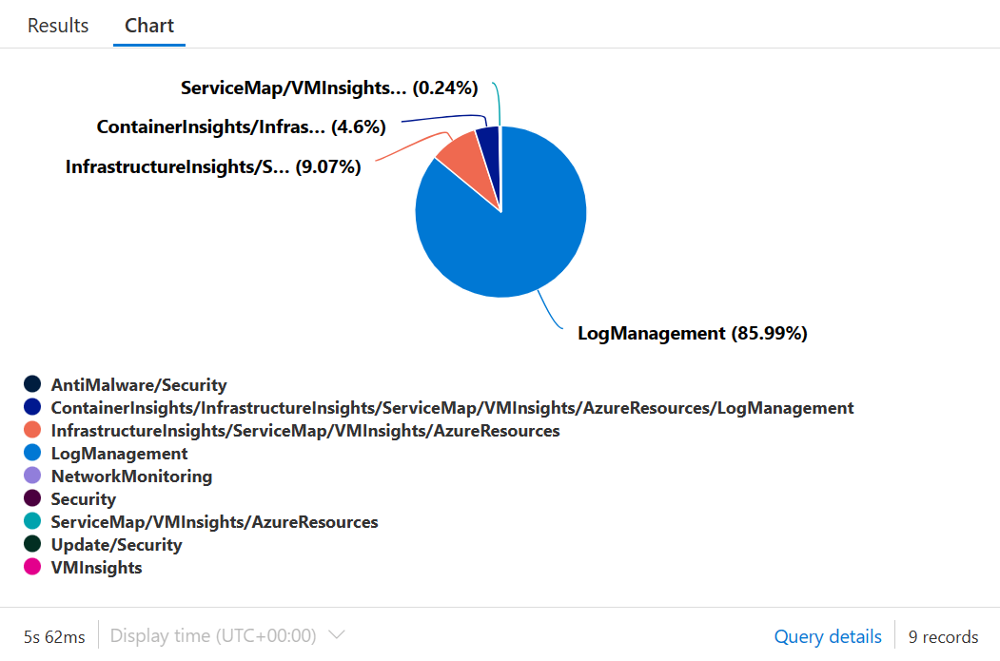
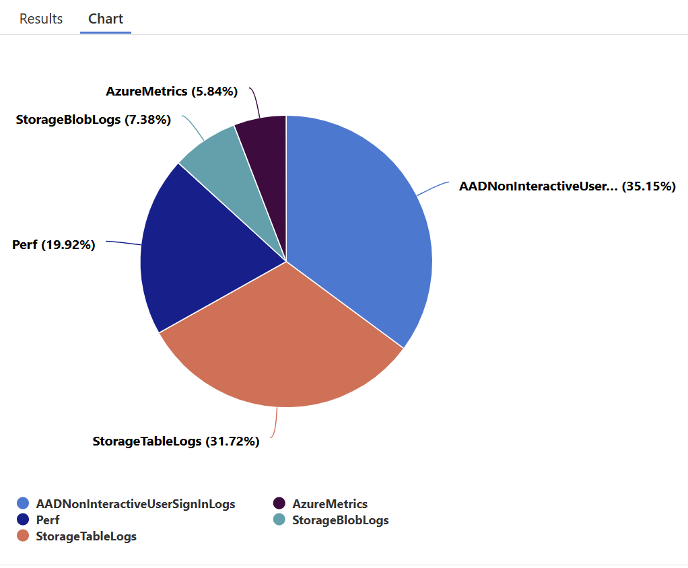
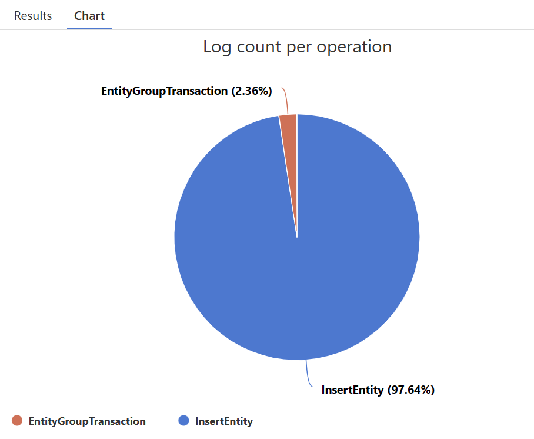
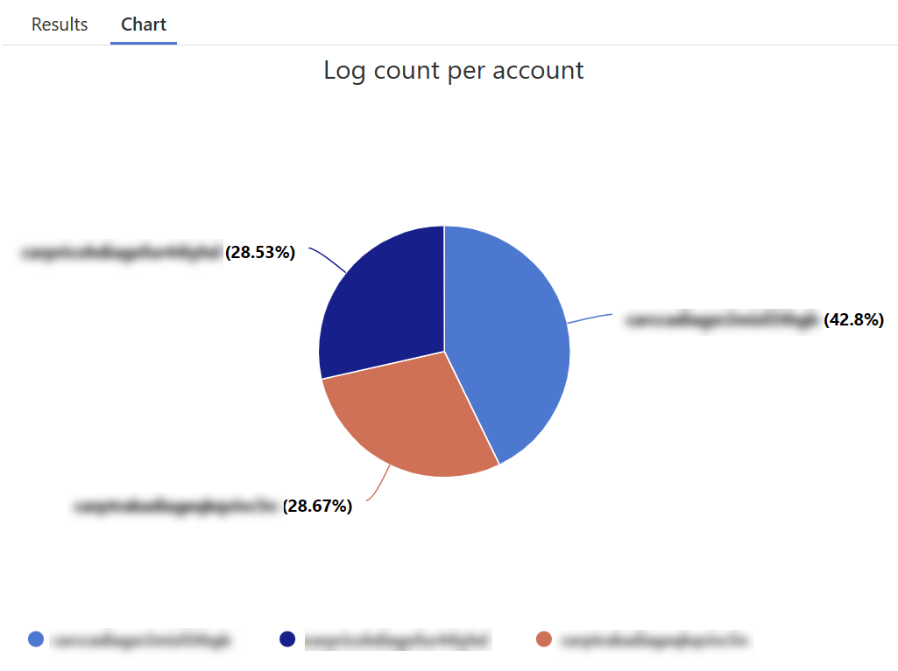
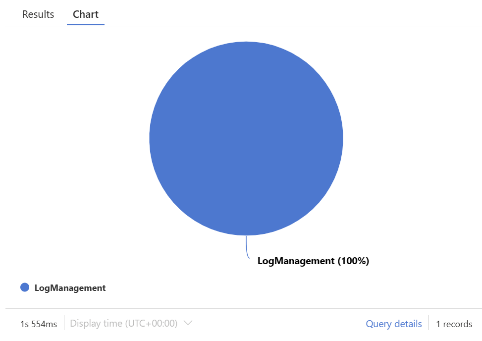
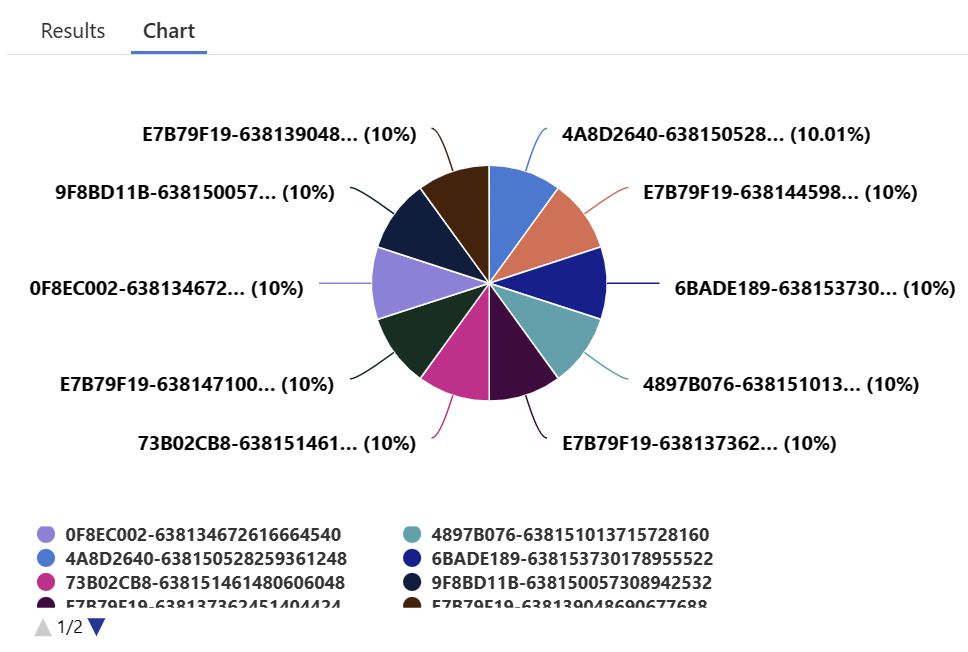
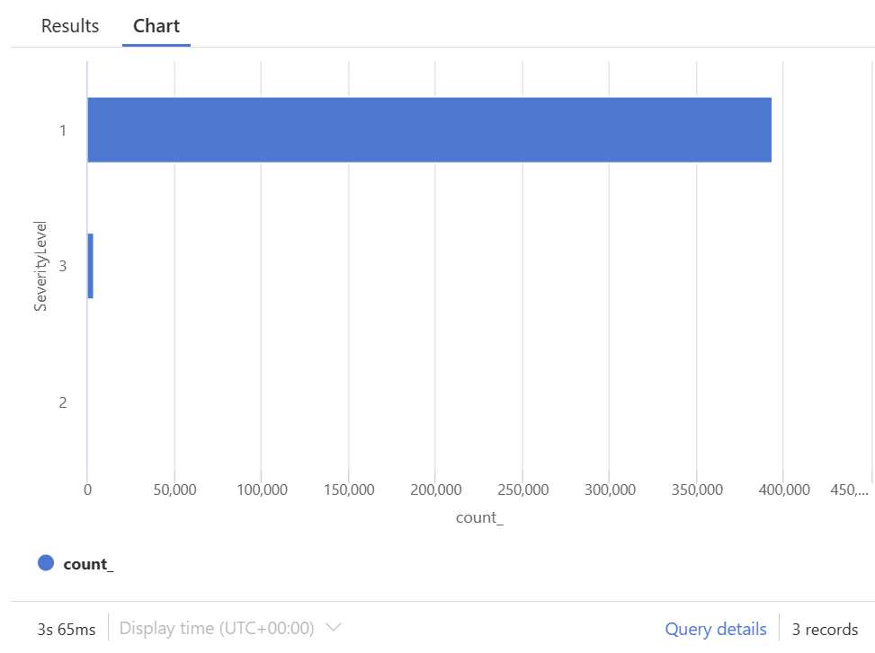
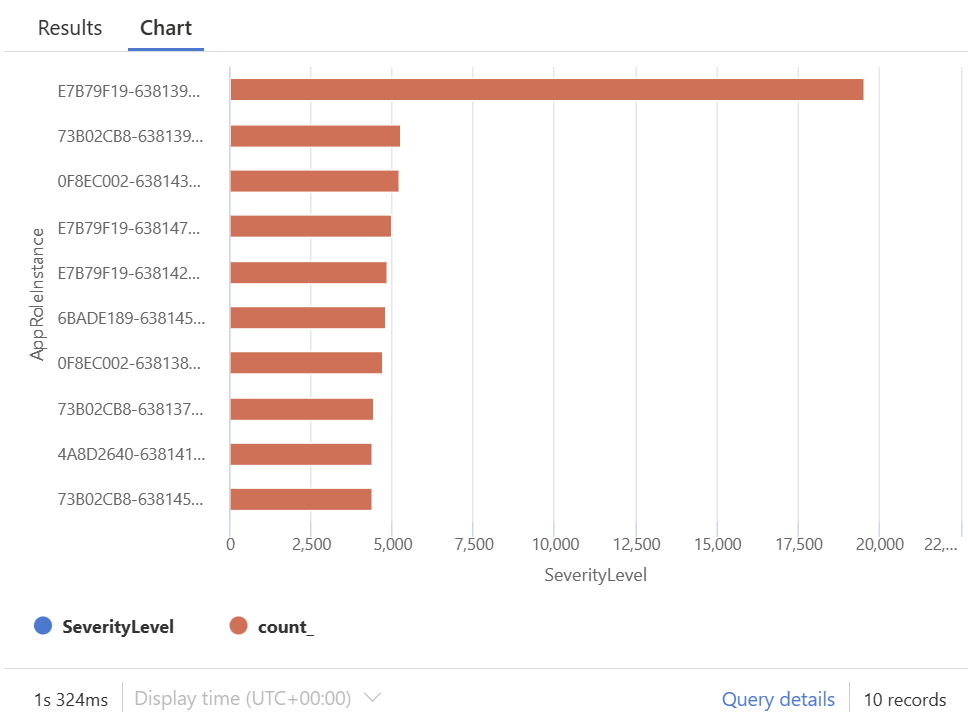

# Azure Monitor - A look at your log producer

## Introduction

Azure monitor is the central service where all your logs and metrics are stored from the resource that are configured to use diagnostics and metrics. 

The cost for Azure monitor is mainly based and storage you use for your logs data so it's good to understand which logging is enabled and what the impact is when enabling this.

Azure monitor can be very insightful but should be used with care and you should monitor your monitoring... monitors... get it ;)

## Log Analytics service explained (at least as i see it)

Most resources and services in Azure have some sort of diagnostics feature. To enable diagnostics logging, or app insights, for your resources, you need to send this data to a `Log Analytics Workspace`. Based on your requirements you can have either a single workspace, or create separate workspaces. 

> An example use case for separate workspaces could be that some data logged is classified and not everyone should be able to access it.

There are many different services in Azure which produce logs and many other services which consume the log data from the workspaces. This is then used to analyze your environment, display dashboards, generate alerts or trigger automated tasks.


A workspace contains data in the form of semi-structured tables and each table has it's own schema [1]. Some tables are generic and can contain data from multiple resources, like `AppExceptions` and some are more specific to a resource type, like `FunctionAppLogs`. 

Resources in Azure can also log to multiple logs at the same time. This requires you to sometimes merge data from different logs. The later is for a different topic but gives an idea of the complexity of log analytics in general.

## The focus of today's blog

This blog focusses on getting more insights into the data of your logs, their size and the cost. And although Azure monitor, and Log Analytics Workspace, have a nice interface to get some basic insights into your usage, as technical guy i want to figure this out myself ;).

## Get information about usage

Each workspace has a `Usage` table. The `Usage` table keeps track of the amount of storage used for each table in the workspace. Azure monitor creates an entry every hour, for each data table, and each entry contains the amount of data collected in `Mbytes`. You can use this data to analyze your log consumption and optimize your cost.

> **See also:** [Azure Monitor Log reference - Usage](https://learn.microsoft.com/en-us/azure/azure-monitor/reference/tables/usage)

### The usage table mapped to the Log Analytics UI

The `Usage` table contains all the information of all the collected logs. This means you need to drill down a bit into the data to understand the structure and how to read it.

If we look at the following screenshot we can see how the query results matches the Logs UI.

```sql
Usage
| where Solution contains "AzureResources" or DataType contains "HealthStateChangeEvent"
| summarize Count = count() by Solution, DataType
| project DataType, Solution, Count
| order by Solution asc, DataType asc
```


On the left we have grouped the logs by `Solution`. We see subnodes that represent the logs for this Solution. On the right you see the query and the results. Only the relevant columns are projected. You can see that a log analytics Solution in the UI actually is aggregated from different Solutions and DataTypes (Like `InsightsMetrics`, `VMBoundPort` etc.).

> The `Count` shows how many entries the Usage log has per `Solution`, per `DataType` for the given period.

## So how can we use this table

### Use Case 1 - Investigate storage account logs

We can start by querying the `Usage` table to find the top consuming tables by Solution. The following query will do exactly that.

```sql
Usage
| where TimeGenerated > startofday(ago(90d))
| where IsBillable == true
| summarize IngestedGB = sum(Quantity) / 1000 by Solution
| sort by IngestedGB desc
| render piechart    
```



We can see that there are three main producers of the total data.

- LogManagement
- InfrastructureInsights/ServiceMap/VMInsights/AzureResources
- ContainerInsights/InfrastructureInsights/ServiceMap/VMInsights/AzureResources/LogManagement

### Drill down

As we can see, the largest consumer of data is the `LogManagement` solution. So we need to drill down a bit more on the solution data.

The following query will add the `DataType` to the equation and show the top 5 logs and their respective data consumption. We use `top 5` as we will probably find the largest on in these 5 logs and this makes the pie chart more readable.

```sql
Usage
| where Solution has "LogManagement"
| summarize IngestedGB = sum(Quantity) / 1000 by Solution, DataType
| project DataType, Solution,  IngestedGB
| order by IngestedGB desc
| top 5 by IngestedGB
| render piechart 
```



This shows us that the following logs are the largest.

- AADNonInteractiveUserSignInLogs
- StorageTableLogs
- Perf

I'm interested in the `StorageTableLog` as there could be some logging that is not required. The `StorageTableLog` is specific to storage accounts and contains a specific schema.

The following query will show the amount of entries that are logged per operation using the `OperationName` column. This could give some indication of the diagnostics settings we need to look into.

```sql
StorageTableLogs
| summarize Count=count() by OperationName
| top 5 by Count
| render piechart  title = "Log count per operation"
```



And lets also look at the top 3 storage accounts that contribute to this logsize

```sql
StorageTableLogs
| summarize Count=count() by AccountName
| top 3 by Count
| render piechart  title = "Log count per account"
```



### Check the diagnostics settings

So let's take a look at the diagnostics settings of this large storage account.


We can see that all the categories are selected, and that metrics is enabled. This could be a valid configuration based on your business requirements but perhaps tha `StorageWrite` is not always required. If you have proper error handling in your application, a write error will be logged when caught. But for auditing is might be required to enable all the categories. 

## Use Case 2 - Another example

```sql
Usage
| where TimeGenerated > startofday(ago(90d))
| where IsBillable == true
| summarize IngestedGB = sum(Quantity) / 1000 by Solution
| sort by IngestedGB desc
| render piechart 
```





```sql
Usage
| where Solution has "LogManagement"
| summarize IngestedGB = sum(Quantity) / 1000 by Solution, DataType
| project DataType, Solution,  IngestedGB
| order by IngestedGB desc
| top 5 by IngestedGB
| render piechart 
```


This shows us that the following logs are the largest.

- AppPerformanceCounters
- AppTraces
- AppMetrics

So `AppPerformanceCounters` are logged every 5 seconds. This is a normal behavior and is expected to result in large log tables. But let's check for anomalies just in case.

The following query gets the top 10 instances for the `AppPerformanceCounters` log to check for one or more excessive logging instances.

> We use `AppRoleInstance` in this query to obfuscate the instance names but normally you would probably use `AppRoleName` instead,

```sql
AppPerformanceCounters
| summarize count() by AppRoleInstance
| top 10 by count_
| render piechart   
```



Nothing special here. All top 10 instances log evenly distributed so we can consider this normal behaviour.

The `AppTraces` can be interesting to look at next. 

Let first look at the log levels as this might indicate if there is actually a serious issues we are missing. The following query sums the messages based on `SeverityLevel`.

```sql
AppTraces
| summarize count() by SeverityLevel
| render barchart  
```



Well, sevirity level `1` is actually [Information](https://learn.microsoft.com/en-us/dotnet/api/microsoft.applicationinsights.datacontracts.severitylevel?view=azure-dotnet) and perhaps this is not really required when there are not issues reported.

So who is logging all these Information messages, lets find out. Using the following query we try to get the top 10 instances that generate logs to see if one or more stand out.

> Again we use `AppRoleInstance` instead of `AppRoleName` to mask the actual names.

```sql
AppTraces
| summarize count() by AppRoleInstance, SeverityLevel
| top 10 by count_
| render barchart
```



Well, one does stand out. Next thing we can now do is investigate the Azure Function App configuration and it's logging settings to see if the logging is valid and required. In general logging on Information level is not required for normal functioning apps.

## It's a wrap... again

So i hope this blog was useful and that it gives you some insight into how you can use the kql language to do a little deep dive into you logging consumption.

## References

1. [Azure Monitor data reference](https://learn.microsoft.com/en-us/azure/azure-monitor/reference/)
2. [OPS115 - Log Analytics workspace design deep dive](https://learn.microsoft.com/en-us/shows/it-ops-talk/ops115-log-analytics-workspace-design-deep-dive)