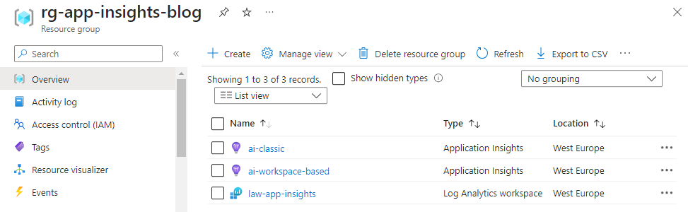
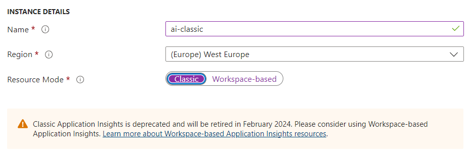
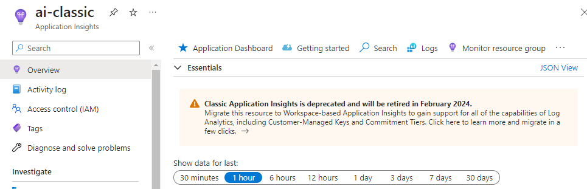
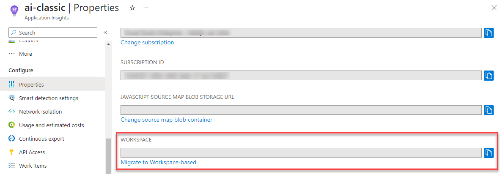
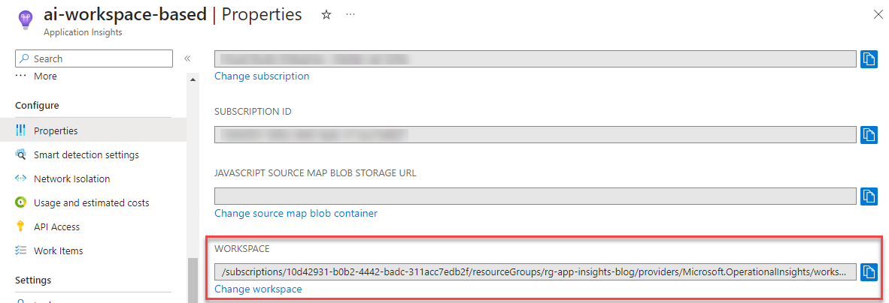
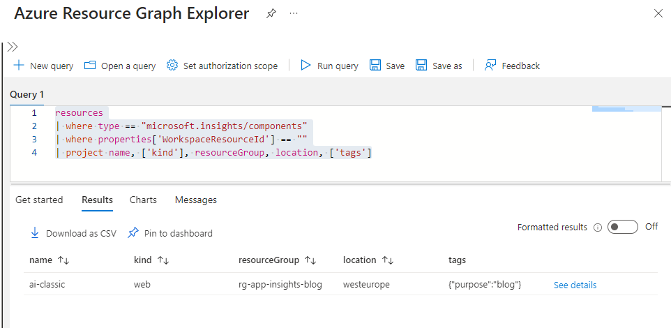
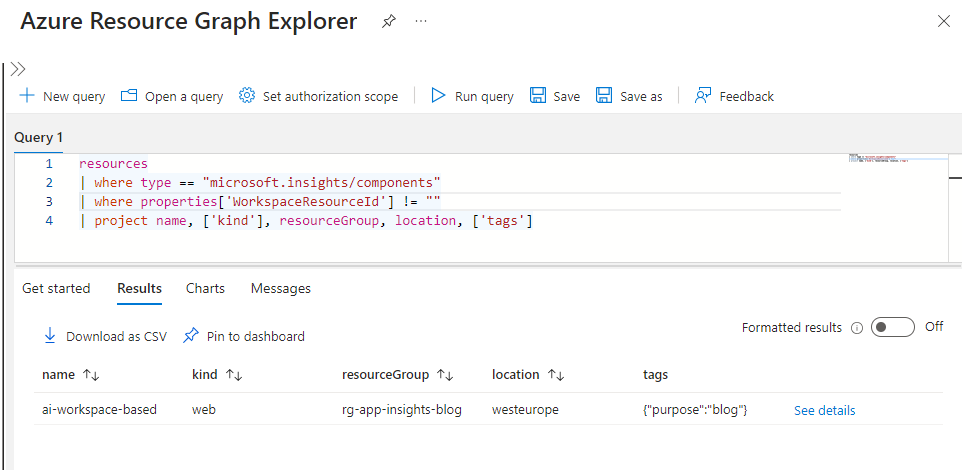

# Why migrate to workspace-based application insights

Classic application insights will be deprecated in 2024. In this short blog i will show you how to find the classis application insights resources using the `Azure Resource Graph Explorer`.

[Azure Resource Graph Explorer](https://portal.azure.com/#view/HubsExtension/ArgQueryBlade)

## Classic application insights deprecated.

On **29 February 2024**, classic application insights in Azure Monitor will be retired and you'll need to migrate your resources to workspace-based application insights by that date. As part of this change, beginning 1 September 2023, any new application insights resources you create will be workspace-based.

Workspace-based application insights offers improved functionality such as:

- Continuous export of app logs via diagnostic settings. 
- The ability to collect data from multiple resources in a single Azure Monitor log analytics workspace. 
- Enhanced encryption and optimization with a dedicated cluster. 
- New options to reduce costs.

> Although most customers' pricing will remain the same, some may experience a change associated with this migration. Use the Azure pricing calculator to confirm your pricing.

## Lab setup

For the purpose of this blog i've setup a simple lab environment with two application insight resources. One in classic mode and one configured to use a log analytics workspace.



## How are we informed

Well, there are a few ways that you might have been informed.

First of all, Microsoft has send out an email to customers which are using the classic application insights in Azure Monitor.

Second, when creating a new application insights resource using the portal (which doesn't happen because we all use [Bicep](https://learn.microsoft.com/en-us/azure/azure-resource-manager/bicep/overview?tabs=bicep) right.), we get a nice yellow `warning`` message telling us that this mode is deprecated.



Lastly, when navigating to an application insights overview blade, we also get a nice yellow `warning` about this type being deprecated.



## Finding "classic" application insights

So how do we find these classic application insights resources. If we only have a few it is pretty easy to do. Just go to the blades and check the warning signs.

But what is we have many of these resources, do we need to go trough all of them. Probably not. Lets look into the power of KQL and the Azure Resource Graph Explorer

If we look at the upgrade steps its pretty easy to determine how to detect the classic application insights. We can look at the value of the Workspace property.

Classic based have an empty property



Workspace based have the property set to the Log Analytics Workspace used by the application insights resource.



## Resource Graph Explorer

We can use this information to query our environment for these resources using the `Azure Resource Graph Explorer`.

Navigate to the explorer and use the following KQL query to find all insights resources that are not using a workspace.

```sql
resources
| where type == "microsoft.insights/components"
| where properties['WorkspaceResourceId'] == ""
| project name, ['kind'], resourceGroup, location, ['tags']
```

> Notice the query looks for components with an empty value for `WorkspaceResourceId`.




## Sanity check

If we reverse the query we should find the application insights that are using a workspace-based configuration. Use the following KQL query to find these insights components. 


```sql
resources
| where type == "microsoft.insights/components"
| where properties['WorkspaceResourceId'] != ""
| project name, ['kind'], resourceGroup, location, ['tags']
```

> Notice the query looks for components with an non-empty value for `WorkspaceResourceId`.



## Azure Policy

Azure would not be Azure if these things could be automated and governed using the power of Azure policies.

There is a Azure Policy definition available which allows you to monitor for application insights there are not linked to a log analytics workspace. 

You can also use this to `deny` deploying a application insights resource using the classic mode, for instance using IaC.

[Azure Policy definition at AzAdvertizer](https://www.azadvertizer.net/azpolicyadvertizer/d550e854-df1a-4de9-bf44-cd894b39a95e.html)


## Roundup

In this blog i've showed you how to use the power of KQL to find resources in your environment based on your personal criteria. In this case we used the information from the application insights migration tutorial to find all resources which are not compliant to the new configuration.

I hope this was useful and i can help you in your daily work.

## Other resources

1. [Application insights overview](https://learn.microsoft.com/en-us/azure/azure-monitor/app/app-insights-overview)
2. [Migrate to workspace-based application insights resources](https://learn.microsoft.com/en-us/azure/azure-monitor/app/convert-classic-resource)